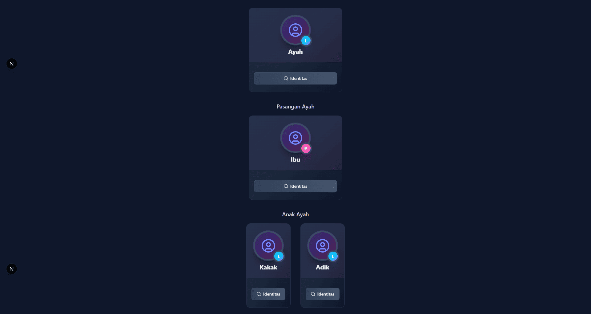
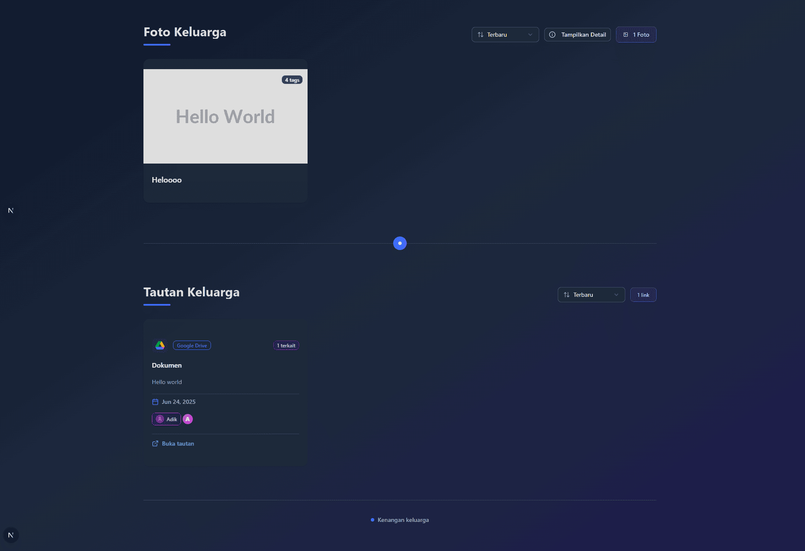

# 🏠 Selamat Datang di Beranda Pohon Keluarga

*Beranda adalah jantung dari perjalanan digital keluarga Anda - tempat di mana cerita keluarga dimulai dan kenangan hidup kembali.*

---

Setelah berhasil masuk, **Beranda** adalah halaman pertama yang menyambut Anda dengan kehangatan keluarga digital. Mari jelajahi setiap sudutnya!

---

## 🌳 Memahami Struktur Pohon Keluarga

Sebelum menjelajah lebih dalam, mari pahami "DNA digital" pohon keluarga kita:

:::info **Konsep Penting**
Setiap halaman keluarga memiliki **3 baris ajaib**:
- **Baris 1**: Keturunan utama (generasi fokus)
- **Baris 2**: Pasangan hidup dari keturunan
- **Baris 3**: Anak-anak dari pasangan tersebut
:::

:::tip **Contoh Mudah**
Jika yang ditampilkan adalah keluarga ibumu:
- **Baris 1**: Ibu (keturunan)
- **Baris 2**: Ayah (pasangan ibu) 
- **Baris 3**: Kamu dan saudara-saudaramu (anak-anak)
:::

---

## 🎯 Tiga Bagian Utama Beranda

### 💫 1. Body - Inti Pohon Keluarga

  
  
  
  *Di sinilah keajaiban silsilah keluarga terpampang! ✨*

Area tengah ini menampilkan **peta visual keluarga** dengan tiga generasi sekaligus. Setiap kotak mewakili anggota keluarga yang terhubung dalam benang merah kasih sayang.

:::note **Perhatian Khusus**
Node paling atas **bukan selalu kepala keluarga**, melainkan **keturunan yang sedang menjadi fokus**. Struktur ini membantu Anda memahami hubungan dari perspektif generasi tertentu.
:::

---

### 🧭 2. Header - Navigasi Cerdas

  
  
  
  *Kompas digital untuk menjelajahi setiap cabang keluarga! 🧭*

Header terbagi menjadi **tiga navigator pintar**:

#### 📋 **Sidebar**
Panel samping yang memberikan akses cepat ke berbagai fitur. *(Pelajari lebih lanjut di halaman khusus Sidebar)*

#### ⬆️ **Tombol Kembali ke Generasi Sebelumnya**
Tombol ajaib yang mengangkat Anda **satu tingkat generasi ke atas**:
- **Fungsi**: Menampilkan orang tua dari generasi yang sedang ditampilkan
- **Contoh**: Jika sekarang menampilkan keluarga ayahmu, tombol ini akan membawa ke keluarga kakek-nenekmu

#### 🔍 **Kolom Pencarian Keluarga**
Fitur pencarian pintar untuk menemukan anggota keluarga:
- Ketik nama yang dicari
- Klik hasil pencarian
- Langsung diarahkan ke halaman keluarga orang tersebut

---

### 📸 3. Footer - Galeri Kenangan

  
  
  
  *Tempat kenangan indah keluarga hidup kembali! 💝*

Bagian bawah beranda menyimpan **harta karun digital keluarga** dalam dua kategori:

#### 🖼️ **Foto Keluarga**
Foto-foto yang terkait dengan anggota keluarga di halaman ini

#### 🔗 **Tautan Keluarga**
Jembatan menuju koleksi digital yang lebih luas

:::note
Untuk menambahkan foto ataupun link, anda bisa menuju halaman ***Kenangan Kita***
:::

---

## 🎉 Mulai Menjelajah!

Beranda adalah **gerbang utama** menuju ribuan cerita keluarga. Setiap klik, setiap navigasi, setiap pencarian akan membawa Anda lebih dekat dengan akar dan cabang pohon keluarga yang kaya akan kenangan.

### 🌟 Tips Eksplorasi:
- **Mulai dari diri sendiri** - cari nama Anda dan lihat posisi dalam keluarga
- **Jelajahi ke atas** - gunakan tombol kembali untuk melihat generasi yang lebih tua  
- **Temukan saudara jauh** - manfaatkan fitur pencarian untuk koneksi yang tak terduga
- **Nikmati kenangan** - jangan lewatkan foto dan tautan di bagian footer

---

*"Beranda bukan hanya halaman pertama, tetapi rumah digital tempat setiap anggota keluarga merasa diterima dan terhubung." 🏡*

---

## 🤔 Butuh Bantuan Navigasi?

Jika ada yang membingungkan dalam menjelajahi beranda:
- 👥 Tanya anggota keluarga yang sudah mahir
- 📖 Baca panduan sidebar untuk fitur lanjutan  
- 🔄 Coba eksplorasi bebas - tidak ada yang rusak!

**Ingat: Setiap keluarga unik, begitu juga cara mengeksplorasi pohon keluarga digitalnya! 🤗**

*Terakhir diperbarui pada: Rabu, 25 Juni 2025*