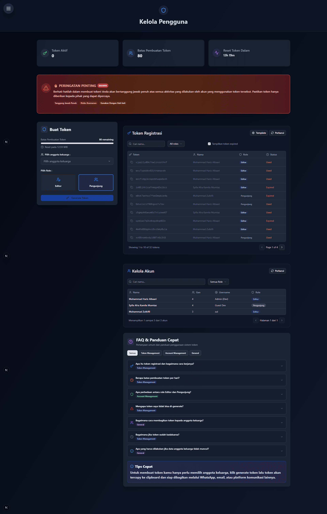
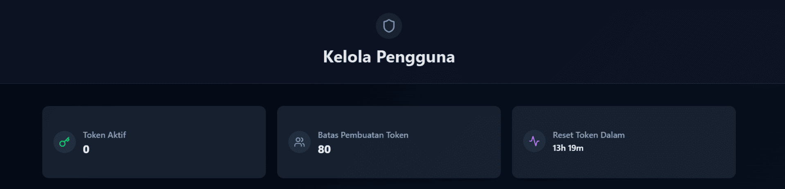
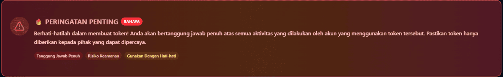
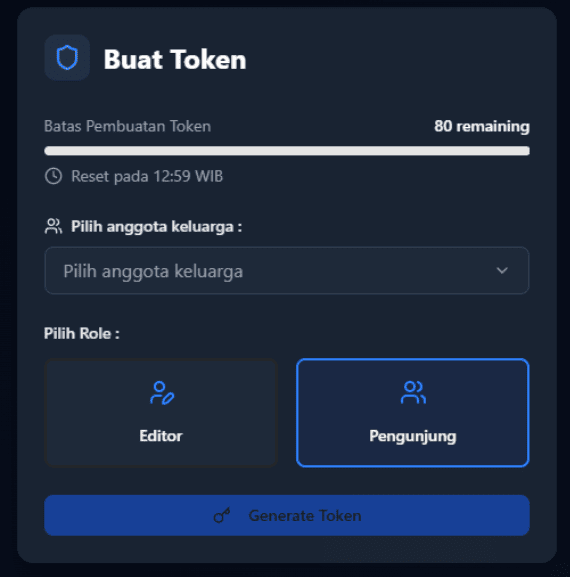
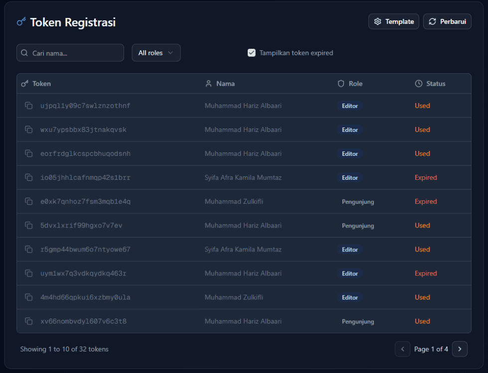
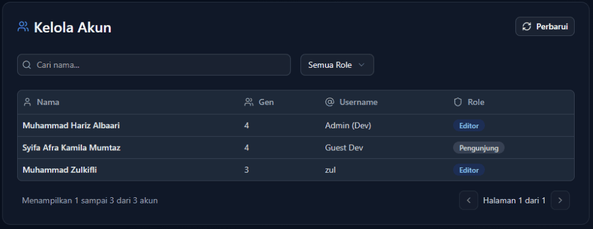
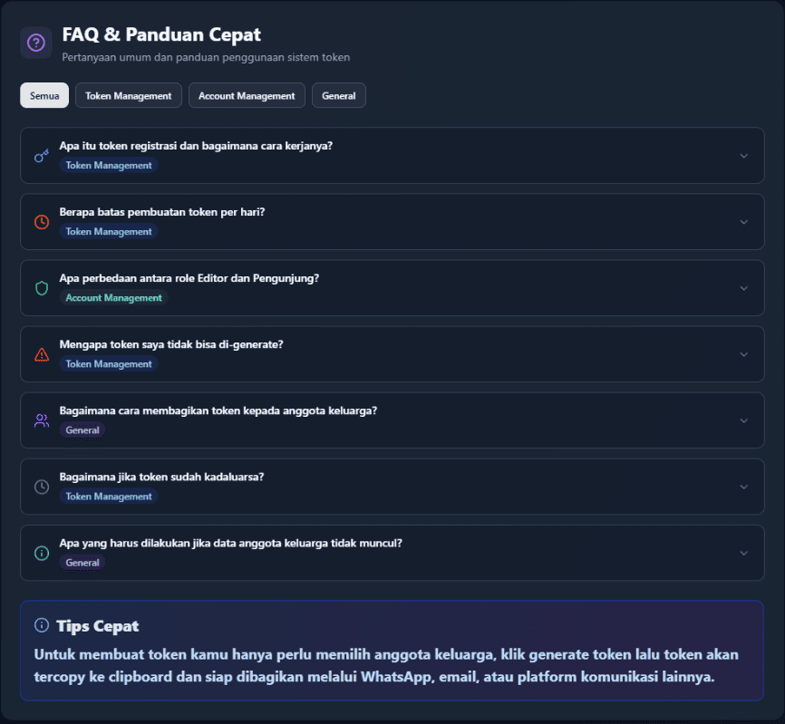

# 👥 Mengelola Pengguna (Editor)

*Kelola akses keluarga digital dengan bijak dan aman. Jaga gerbang warisan keluarga bersama-sama.*

---

:::warning 🛡️ Akses Khusus Editor
Halaman ini eksklusif untuk [Editor](/docs/apa-itu/user_roles_guide#%EF%B8%8F-editor---penjaga-sejarah-keluarga). Sebagai penjaga sejarah keluarga, kepercayaan besar telah diletakkan di pundak Anda.
:::

---

## 🎯 Kemampuan Pengelolaan

Sebagai Editor, Anda memegang kendali penuh atas ekosistem digital keluarga:

- **🎫 Menciptakan Kunci Akses** - Token registrasi untuk anggota baru
- **👀 Memantau Status** - Pelacakan real-time aktivitas token
- **📋 Mengelola Komunitas** - Administrasi seluruh anggota keluarga

---

## 🖼️ Antarmuka Pengelolaan

*Desain yang intuitif untuk pengalaman pengelolaan yang mulus* ✨

---

## 📊 Dashboard Eksekutif

### 🏷️ Ringkasan Aktivitas

Header menyajikan metriks penting untuk pengambilan keputusan cepat:

| 📈 **Indikator** | 💡 **Makna** |
|------------------|--------------|
| **🟢 Token Tersedia** | Token siap pakai untuk pendaftaran |
| **🎯 Sisa Kuota** | Kapasitas pembuatan token hari ini |
| **⏰ Waktu Reset** | Countdown pembaruan kuota harian |

### ⚠️ Zona Tanggung Jawab

:::danger 🚨 Komitmen Editor

**Setiap token adalah perpanjangan kepercayaan keluarga**

- **Akuntabilitas Menyeluruh**: Aktivitas pengguna yang didaftarkan melalui token Anda menjadi tanggung jawab bersama
- **Seleksi Bijaksana**: Berikan akses hanya kepada individu yang memahami nilai warisan keluarga
- **Pengawasan Berkelanjutan**: Pantau jejak digital setiap token yang telah diterbitkan

*Kepercayaan adalah mata uang yang tak ternilai dalam menjaga warisan keluarga* 🦸‍♂️
:::

---

## 🛠️ Pusat Operasi

### 🎫 Studio Token Registrasi

**Proses pemberian akses:**
1. **Seleksi Anggota**: Pilih nama dari daftar keluarga yang tersedia
2. **Aktivasi Token**: Klik tombol "Buat Token" untuk menghasilkan kunci akses
3. **Distribusi Aman**: Token tersimpan otomatis dan siap dibagikan

---

### 📋 Monitor Status Token

**Transparansi informasi:**
- **🔑 Identitas Token**: Kode unik untuk setiap akses
- **⚡ Kondisi**: **Aktif** (siap digunakan), **Expired** (kadaluarsa), **Used** (telah dipakai)
- **👤 Penerbit**: Editor yang bertanggung jawab atas token

> ⏱️ **Ketentuan Keamanan**: Setiap token berlaku 24 jam untuk menjaga integritas sistem

---

### 👨‍👩‍👧‍👦 Direktori Anggota Keluarga

**Profil lengkap anggota:**
- **📛 Identitas Resmi**: Nama lengkap dalam catatan keluarga
- **👤 Alias Digital**: Username untuk interaksi sistem
- **🏷️ Posisi**: Tingkat akses dalam hierarki ([Panduan Role](/docs/apa-itu/user_roles_guide))

---

## 🆘 Solusi Pertanyaan Umum

### 🧩 Panduan Praktis

🔐 Bagaimana mekanisme token registrasi bekerja?

Token registrasi adalah kunci digital yang menghubungkan anggota keluarga dengan sistem. Setiap token dikustomisasi untuk individu tertentu dengan masa aktif 24 jam. Sistem otomatis menonaktifkan token setelah berhasil digunakan untuk menjaga keamanan.

📊 Berapa batasan produksi token harian?

Sistem menerapkan batas maksimal 80 token per periode 24 jam. Reset otomatis terjadi setiap tengah malam WIB. Dashboard menampilkan sisa kuota secara real-time untuk perencanaan yang lebih baik.

🎭 Bagaimana membedakan peran Editor dan Member?

Editor memiliki otoritas penuh: mengedit silsilah, mengelola media, membuat album, administrasi akun, dan menerbitkan token. Member berperan sebagai kontributor dengan akses terbatas untuk menjaga keseimbangan antara partisipasi dan keamanan.

⚠️ Mengapa token gagal dibuat?

Kegagalan pembuatan token disebabkan oleh: kuota harian terpenuhi, belum memilih anggota target, atau gangguan konektivitas. Solusi: periksa dashboard status, pastikan seleksi lengkap, atau gunakan tombol refresh untuk sinkronisasi ulang.

📤 Strategi efektif membagikan token?

Manfaatkan fitur "Copy" untuk mendapatkan pesan template yang telah diformat profesional. Pesan berisi tautan registrasi dan token yang dapat langsung dibagikan melalui berbagai platform komunikasi dengan tampilan yang rapi.

🕐 Penanganan token kadaluarsa?

Token yang melewati batas waktu tidak dapat direvitalisasi. Prosedur standar: buat token pengganti untuk anggota yang sama. Masa berlaku 24 jam memberikan keseimbangan antara keamanan dan fleksibilitas penggunaan.

🔄 Troubleshooting data tidak muncul?

Ketika data anggota tidak tampil, lakukan langkah berikut: klik "Retry" untuk reload, refresh browser secara manual, verifikasi stabilitas koneksi internet. Untuk masalah persisten, eskalasi ke administrator sistem.

---

## 🔒 Protokol Keamanan Unggulan

:::warning 🛡️ Keamanan Sebagai Fondasi

### ✅ Praktik Terbaik:
- **Autentikasi Ganda**: Verifikasi identitas sebelum menerbitkan token
- **Dokumentasi Komprehensif**: Catat setiap distribusi untuk audit trail
- **Monitoring Proaktif**: Pantau perilaku pengguna baru secara berkala
- **Komunikasi Transparan**: Laporkan anomali kepada admin tanpa penundaan

### ❌ Zona Larangan:
- **Distribusi Massal**: Hindari pembagian token tanpa verifikasi
- **Produksi Berlebihan**: Jangan melebihi kebutuhan aktual
- **Mengabaikan Peringatan**: Tanggapi setiap notifikasi sistem
- **Pengawasan Pasif**: Jangan lepas tangan setelah token diterbitkan
:::

---

## 🤝 Pusat Bantuan

Ketika membutuhkan dukungan tambahan:

- 🌟 **Kolaborasi Internal**: Konsultasi dengan sesama Editor berpengalaman
- 🛠️ **Dukungan Teknis**: Hubungi tim administrator untuk isu sistem
- 💡 **Konsultasi Strategis**: Diskusi dengan pengelola HisTree keluarga
- 📚 **Eksplorasi Mandiri**: Telusuri dokumentasi lengkap di pusat panduan

:::tip 💝 Apresiasi untuk Guardian Digital
**Terima kasih telah menjadi guardian warisan keluarga!** 

Dedikasi Anda dalam menjaga integritas data dan membimbing akses anggota keluarga adalah investasi berharga untuk generasi mendatang. Setiap keputusan bijak yang Anda ambil memperkuat fondasi digital warisan keluarga.

*Warisan sejati bukan hanya tentang masa lalu, tetapi tentang bagaimana kita mempersiapkan masa depan bersama* 🌟
:::

---

## 🤔 Butuh Bantuan Kelola Pengguna?

Jika ada yang membingungkan dalam mengelola pengguna:
- 👥 Tanya anggota keluarga yang sudah mahir  
- 🔄 Coba eksplorasi bebas - tidak ada yang rusak!

**Ingat: Setiap keluarga unik, begitu juga cara mengeksplorasi pohon keluarga digitalnya! 🤗**

*Terakhir diperbarui pada: Rabu, 25 Juni 2025*