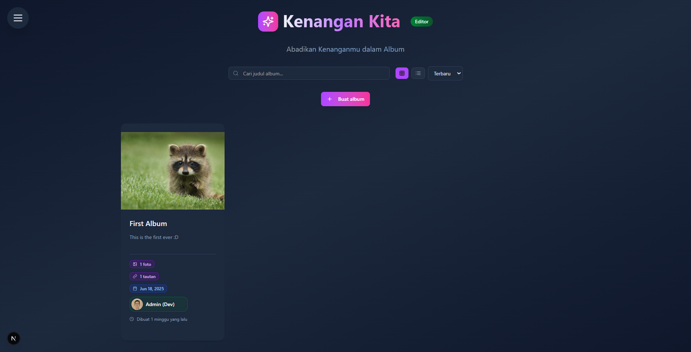
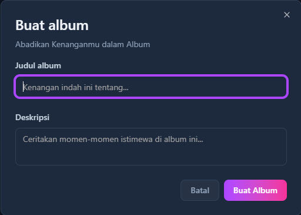
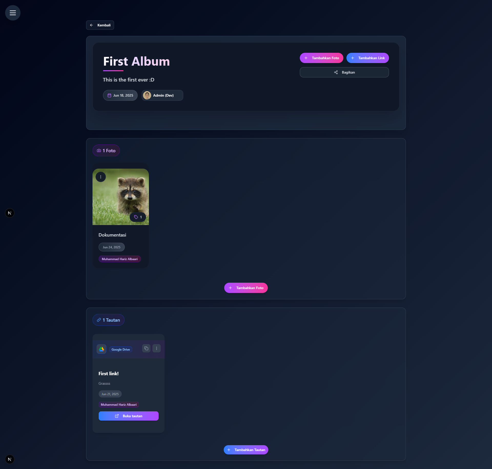
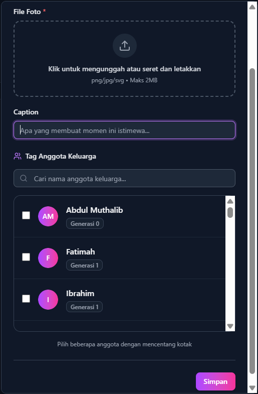
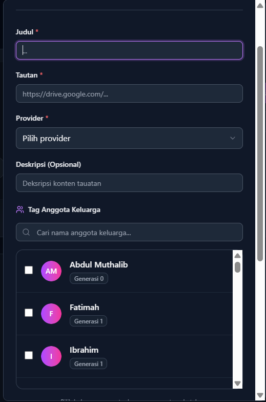

# 📸 Kenangan Kita

Kenangan Kita adalah fitur galeri digital yang memungkinkan Anda mengorganisir dan berbagi foto serta tautan berharga keluarga dalam bentuk album yang terstruktur. Abadikan momen-momen istimewa dan akses mudah ke koleksi kenangan keluarga!

## 🎯 Fitur Utama

### 📁 **Manajemen Album**
- Buat album tematik untuk berbagai acara dan momen
- Organisasi konten berdasarkan kategori waktu atau peristiwa
- Tampilan kartu album dengan informasi ringkas

### 🖼️ **Galeri Multimedia**
- Upload dan simpan foto keluarga
- Simpan tautan penting (Google Drive, YouTube, dll.)
- Tag anggota keluarga dalam setiap konten

### 👥 **Sistem Tagging Keluarga**
- Tandai anggota keluarga dalam foto dan tautan
- Pencarian konten berdasarkan orang yang terkait
- Koneksi dengan data silsilah keluarga

---

## 🖥️ Antarmuka Kenangan Kita

### 📋 **Halaman Utama Galeri**

Tampilan utama menampilkan:
- **Grid Album** - Koleksi semua album keluarga
- **Informasi Album** - Jumlah foto, tautan, tanggal pembuatan, dan pembuat
- **Tombol Aksi** - Buat album baru dan navigasi

#### **Informasi Kartu Album**
Setiap kartu album menampilkan:

| Elemen | Keterangan |
|---------|------------|
| 🖼️ **Thumbnail** | Gambar preview dari album |
| 📊 **Statistik** | Jumlah foto dan tautan |
| 📅 **Metadata** | Tanggal pembuatan |
| 👤 **Pembuat** | Anggota keluarga yang membuat album |

---

## 🔧 Membuat dan Mengelola Album

### ➕ **Membuat Album Baru**

Untuk membuat album baru:

1. **Klik tombol "Buat Album"** di halaman utama
2. **Isi form dengan:**
   - **Judul Album** - Nama yang mudah diidentifikasi
   - **Deskripsi** - Penjelasan singkat tentang album

:::tip **Tips Penamaan Album**
Gunakan nama yang deskriptif seperti:
- "Lebaran 2025"
- "Liburan Keluarga Bali"
- "Dokumentasi Pernikahan"
:::

---

## 📱 Halaman Detail Album

### 🏠 **Struktur Halaman Album**

Halaman album terbagi menjadi tiga bagian utama:

#### **1. Header Album**
- **Info Pembuat** - Anggota keluarga yang membuat album
- **Tombol Aksi** - Tambah foto, tautan, dan share

#### **2. Koleksi Foto**
- **Grid Foto** - Tampilan visual semua foto dalam album
- **Tag Keluarga** - Daftar anggota yang ditandai dalam foto
- **Metadata** - Tanggal upload dan informasi tambahan

#### **3. Koleksi Tautan**
- **Daftar Link** - Tautan eksternal terkait album
- **Provider Info** - Platform sumber (Google Drive, YouTube, dll.)
- **Tag Keluarga** - Anggota yang terkait dengan tautan

---

## 📤 Menambahkan Konten ke Album

### 📷 **Menambahkan Foto**

Proses menambah foto:

1. **Klik "Tambahkan Foto"** di header album
2. **Upload File:**
   - Drag & drop atau klik area upload
   - Format: PNG/JPG/SVG (Maks 2MB)
3. **Isi Informasi:**
   - **Caption** - Deskripsi foto
   - **Tag Anggota** - Pilih dari daftar keluarga
4. **Simpan** untuk menambahkan ke album

#### **Sistem Tagging Foto**
- **Pencarian Nama** - Cari anggota keluarga dengan mengetik
- **Multi-select** - Tandai beberapa anggota sekaligus
- **Generasi Info** - Tampilan generasi keluarga untuk konteks

### 🔗 **Menambahkan Tautan**

Proses menambah tautan:

1. **Klik "Tambahkan Link"** di header album
2. **Isi Form:**
   - **Judul** - Nama deskriptif untuk tautan
   - **URL** - Link lengkap ke sumber eksternal
   - **Provider** - Pilih platform (Google Drive, YouTube, dll.)
   - **Deskripsi** *(Opsional)* - Informasi tambahan
3. **Tag Anggota** - Hubungkan dengan anggota keluarga terkait
4. **Simpan** untuk menambahkan ke album

:::info **Provider yang Didukung**
Sistem mendukung berbagai platform populer:
- Google Drive
- YouTube  
- Dropbox
- OneDrive
- Dan platform lainnya
:::

---

## 🔍 Tips dan Best Practices

### 📝 **Organisasi Album**

Bagaimana cara mengorganisir album dengan baik?

- Buat album berdasarkan peristiwa atau periode waktu
- Gunakan nama yang konsisten dan mudah dicari
- Pisahkan album berdasarkan jenis acara (formal vs casual)

Berapa banyak foto ideal dalam satu album?

- Usahakan 10-50 foto per album untuk navigasi yang optimal
- Pisahkan foto jika jumlah terlalu banyak
- Prioritaskan kualitas dibanding kuantitas

### 🏷️ **Sistem Tagging Efektif**

Mengapa penting men-tag anggota keluarga?

- Memudahkan pencarian foto berdasarkan orang
- Membuat koneksi dengan data silsilah keluarga
- Membantu anggota keluarga menemukan foto mereka

---

## 🚨 Troubleshooting

### ❓ **Masalah Umum**

File foto tidak bisa diupload?

Pastikan:
- Ukuran file maksimal 2MB
- Format file PNG, JPG, atau SVG
- Koneksi internet stabil

Tidak bisa menambah anggota dalam tag?

- Pastikan anggota sudah terdaftar dalam silsilah keluarga
- Coba refresh halaman dan ulangi proses tagging
- Periksa ejaan nama saat mencari

Tautan tidak bisa dibuka?

- Pastikan URL lengkap dan valid
- Periksa pengaturan privasi di platform sumber
- Gunakan link yang dapat diakses publik atau dengan izin

---

## 🤔 Butuh Bantuan?

Jika ada yang membingungkan dalam menjelajahi beranda:
- 👥 Tanya anggota keluarga yang sudah mahir
- 📖 Baca panduan sidebar untuk fitur lanjutan  
- 🔄 Coba eksplorasi bebas - tidak ada yang rusak!

***"Kenangan indah adalah harta yang tak ternilai, simpan dan bagikan dengan keluarga tercinta."*** 🤗

*Terakhir diperbarui pada: Rabu, 25 Juni 2025*
