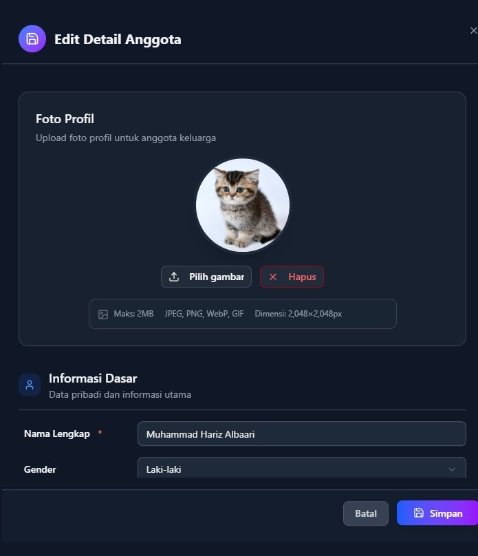
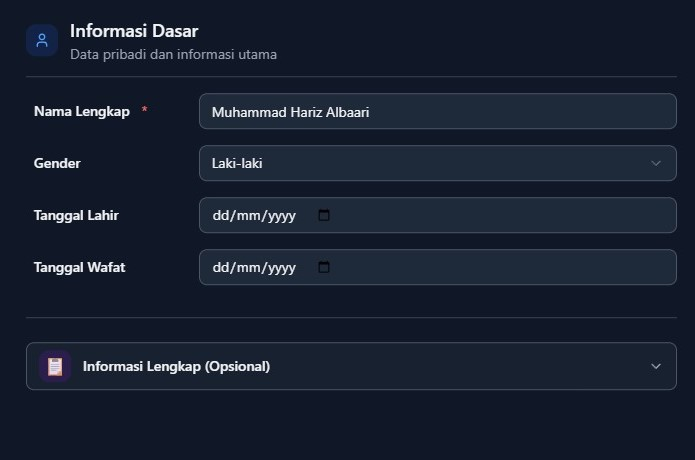
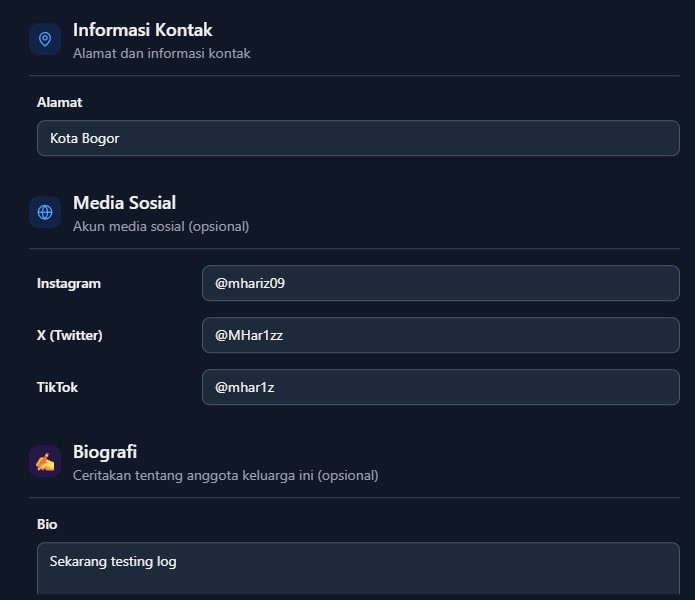

# 👥 Cara Mengelola Profil Anggota Keluarga (Editor)

*Panduan lengkap untuk membuat dan mengelola profil anggota keluarga yang modern dan informatif*

---

## 👁️ **Tampilan Profil Anggota**

### 🎨 **Halaman Profil yang Modern**

#### 🌟 **Fitur Tampilan:**
- **📱 Responsive Design** - Sempurna di semua perangkat
- **🎯 Layout Terstruktur** - Informasi mudah ditemukan
- **🔗 Quick Access** - Link langsung ke media sosial
- **📅 Timeline Visual** - Tanggal penting dalam kehidupan

#### 💫 **Elemen Profil:**
- **🖼️ Foto Profil** - Ditampilkan prominently
- **📝 Bio Section** - Cerita hidup yang menarik
- **🔗 Social Links** - Akses cepat ke media sosial

---

## 📋 **Informasi yang Dapat Disimpan**

### ✅ **Data Wajib:**
- **👤 Nama Lengkap** - Identitas utama anggota keluarga

### 🔄 **Data Opsional:**
- **👫 Jenis Kelamin** - Untuk keperluan pohon keluarga
- **📖 Biografi** - Cerita hidup dan pencapaian
- **🏠 Alamat** - Lokasi tempat tinggal
- **🎂 Tanggal Lahir** - Untuk timeline dan reminder ulang tahun
- **🕊️ Tanggal Wafat** - Dokumentasi memorial (jika diperlukan)

### 🆕 **Data Tambahan Modern:**
- **🖼️ Foto Profil** - Gambar representatif anggota
- **📸 Instagram** - Link ke profil Instagram
- **🐦 Twitter/X** - Link ke profil Twitter
- **🎵 TikTok** - Link ke profil TikTok

---

## ✏️ **Cara Menambah/Edit Anggota Keluarga**

### 🖥️ **Form Editor Multi-Step**

:::warning WASPADA
Cukup dengan menyimpan nama lengkap dan foto saja, hati-hati dengan informasi sensitif lainnya, karena semua anggota keluarga dapat mengaksesnya.
:::

Proses penambahan anggota menggunakan sistem 3 langkah yang mudah:

#### 📋 **Step 1 - Foto Profil**

- 🎨 Jangan lupa Crop dan adjust sebelum di upload
- ⚡ Lihat preview langsung hasil foto

#### 📱 **Step 2 - Informasi Dasar**

- 👤 **Nama Lengkap** (wajib diisi)
- 👫 **Jenis Kelamin** 
- 🎂 **Tanggal Lahir** (gunakan date picker)
- 🕊️ **Tanggal Wafat**

#### ✅ **Step 3 - Informasi Tambahan**

- 🏠 **Alamat** 
- 📱 **Media Sosial** (Instagram, Twitter, TikTok)
- 📖 **Biografi** (gunakan rich text editor)

### 🎯 **Tips Mengisi Form:**

#### 📝 **Untuk Biografi:**
- Ceritakan pencapaian penting
- Tambahkan hobi dan minat
- Sertakan momen berkesan
- Gunakan formatting untuk readability

#### 📅 **Untuk Tanggal:**
- Gunakan date picker untuk akurasi
- Format otomatis akan disesuaikan
- Kosongkan jika tidak diketahui

#### 🔗 **Untuk Media Sosial:**
- Bisa berupa username atau URL lengkap
- Sistem akan otomatis memvalidasi
- Link akan langsung bisa diklik di profil

## 🤔 **Butuh Bantuan?**

Jika mengalami kesulitan dalam mengelola profil anggota:
- 👥 Konsultasi dengan anggota keluarga lain
- 🔄 Coba eksplorasi fitur-fitur yang tersedia
- 📱 Manfaatkan tooltips dan petunjuk di interface

**Ingat: Setiap anggota keluarga memiliki cerita unik yang layak didokumentasikan dengan baik! 🤗**

*Panduan ini dirancang untuk membantu Anda memanfaatkan fitur profil anggota keluarga secara maksimal.*