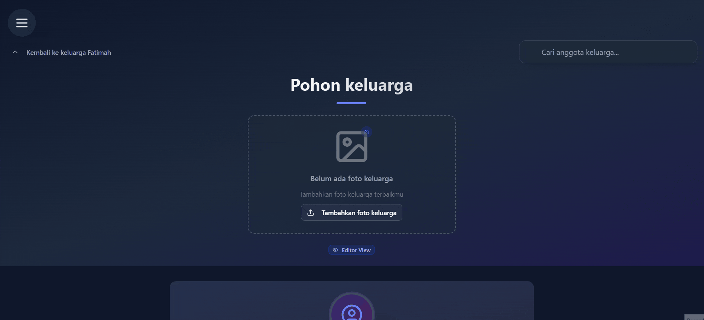
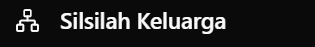
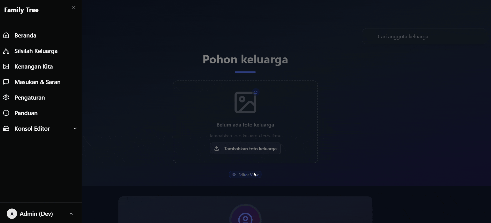
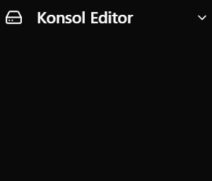
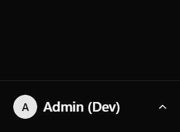

# 📋 Navigasi Sidebar

Sidebar adalah komponen navigasi utama yang memudahkan Anda menjelajahi seluruh fitur aplikasi Family Tree. Mari pelajari cara menggunakan setiap fiturnya!

## 🎯 Cara Mengakses Sidebar

*Klik ikon hamburger menu (☰) di pojok kiri atas untuk membuka sidebar*

---

## 🏠 Menu Utama

### 1. **Beranda**

Halaman utama yang menampilkan ringkasan informasi keluarga.

➡️ [**Pelajari lebih lanjut tentang Beranda**](/docs/apa-itu/beranda_guide)

### 2. **Silsilah Keluarga** 

Visualisasi pohon keluarga interaktif yang memungkinkan Anda melihat hubungan antar anggota keluarga.

➡️ [**Jelajahi fitur Silsilah Keluarga**](/docs/apa-itu/silsilah_keluarga)

### 3. **Kenangan Kita**

Koleksi berharga yang mengabadikan momen-momen spesial keluarga.

➡️ [**Kelola Kenangan Keluarga**](/docs/apa-itu/kenangan_kita)

### 4. **Masukan dan Saran**

💌 Suara Anda adalah harta bagi kami! Klik untuk berbagi masukan - setiap saran membantu HisTree tumbuh lebih baik untuk keluarga anda.

---

## ⚙️ Pengaturan & Bantuan

### 5. **Pengaturan**

Personalisasi tampilan aplikasi sesuai preferensi Anda dengan memilih mode gelap dan terang

### 6. **Panduan**

Tombol ini akan mengarahkan anda ke website ini.

---

## 👨‍💼 Fitur Khusus Editor

### 7. **Konsol Editor**

Akses panel kontrol administratif dengan sub-menu:

#### 📨 **Pesan Masuk**
Kelola dan tanggapi masukan serta saran dari pengguna lain

#### 👥 **Kelola Pengguna** 
Administrasi akun pengguna dan pengaturan hak akses
➡️ [**Detail Pengelolaan Pengguna**](/docs/apa-itu/kelola_pengguna)

#### 📊 **Log Aktivitas**
Monitor dan review aktivitas sistem untuk menjaga keamanan
➡️ [**Panduan Log Aktivitas**](/docs/apa-itu/log_aktifitas)

---

## 👤 Informasi Profil

### 8. **Footer Pengguna**

Panel informasi di bagian bawah sidebar yang menampilkan:

| Informasi | Deskripsi |
|-----------|-----------|
| 📧 **Email** | Alamat email akun yang sedang aktif |
| 🏷️ **Role** | Status peran pengguna (Pengunjung/Editor) |
| 🚪 **Logout** | Tombol untuk keluar dari aplikasi dengan aman |\

---

## 🤔 Butuh Bantuan?

Jika ada yang membingungkan dalam menjelajahi beranda:
- 👥 Tanya anggota keluarga yang sudah mahir
- 🔄 Coba eksplorasi bebas - tidak ada yang rusak!

**Ingat: Setiap keluarga unik, begitu juga cara mengeksplorasi pohon keluarga digitalnya! 🤗**

*Terakhir diperbarui pada: Rabu, 25 Juni 2025*