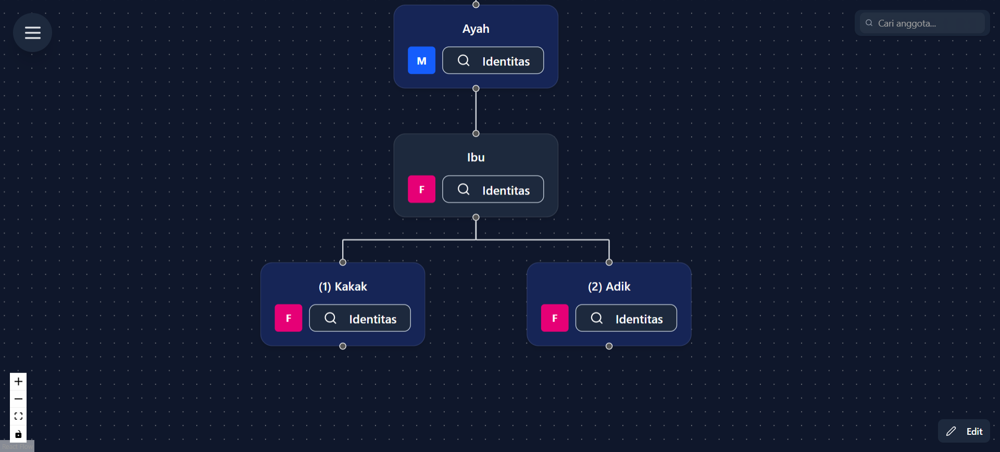
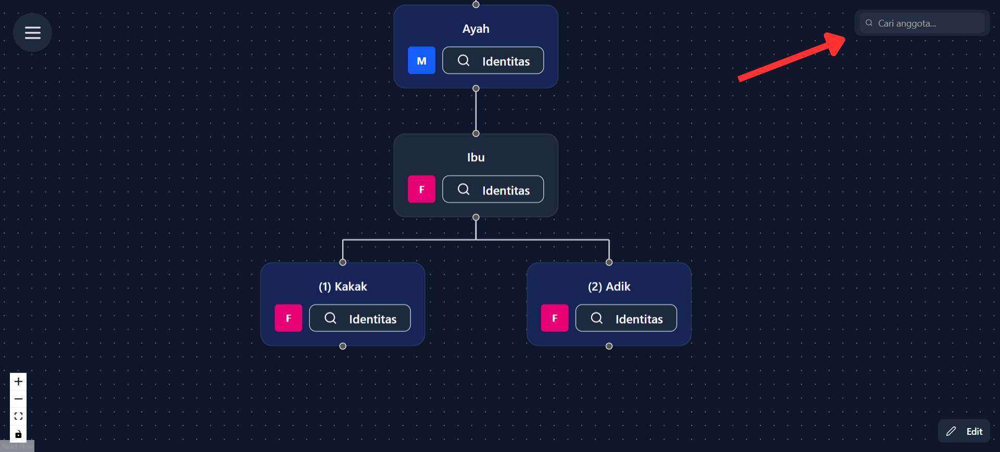
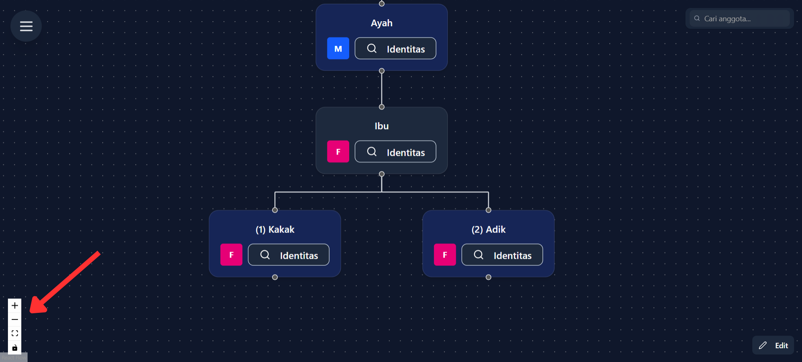
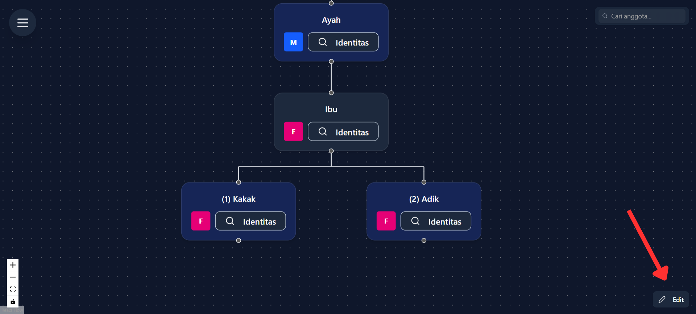
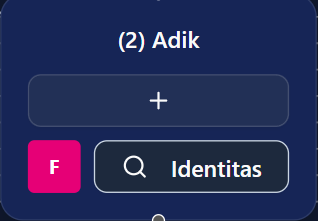

# 🌳 Silsilah Keluarga

Silsilah Keluarga adalah fitur visualisasi pohon keluarga interaktif yang memungkinkan Anda melihat hubungan kekerabatan dengan tampilan yang jelas dan mudah dipahami. Jelajahi sejarah keluarga Anda dengan cara yang modern dan intuitif!

## 📋 Konsep Penting Struktur Keluarga

### 🔢 **Sistem Baris Genap-Ganjil**
Pohon keluarga menggunakan sistem penempatan berdasarkan baris:

- **Baris Genap (0, 2, 4, ...)** = **Keturunan Langsung**
  - Contoh: Ayah, Anak-anak
- **Baris Ganjil (1, 3, 5, ...)** = **Pasangan dari Keturunan**
  - Contoh: Ibu (pasangan dari Ayah)

:::info **Catatan Penting**
Karena sistem ini, terkadang Ibu bisa berada di atas Ayah dalam pohon jika Ibu adalah keturunan langsung dari keluarga diatasnya.
:::

---

## 🎯 Fitur Utama

### 📊 **Visualisasi Pohon Keluarga**
- Tampilan hierarkis berdasarkan sistem baris genap-ganjil
- Node interaktif untuk setiap anggota keluarga
- Garis penghubung yang menjelaskan relasi kekerabatan
- Zoom in/out untuk melihat detail atau gambaran besar

### 👤 **Kartu Identitas Digital**
Setiap anggota keluarga memiliki kartu identitas yang menampilkan:
- **Icon Gender**
- **Nama Lengkap**
- **Nomor Urutan** - Posisi dalam urutan saudara kandung
- **Tombol Identitas** - Akses ke informasi detail

---

## 🖥️ Antarmuka Silsilah Keluarga

### 🔍 **Panel Navigasi**

Tampilan utama menunjukkan:
- **Keturunan Langsung** pada baris genap
- **Pasangan Keturunan** pada baris ganjil
- **Urutan Saudara** dengan penomoran (1), (2), dst.

### 🔍 **Fitur Pencarian**

Di **pojok kanan atas** terdapat search bar yang berfungsi seperti Ctrl+F di Chrome:
- Ketik nama anggota keluarga
- Sistem akan highlight/fokus ke anggota yang dicari
- Sangat berguna untuk keluarga besar dengan banyak anggota

### 📱 **Kontrol Interaktif**

#### **Tombol Zoom & Navigasi**

| Kontrol | Fungsi | Lokasi |
|---------|---------|---------|
| ➕ **Zoom In** | Memperbesar tampilan untuk detail | Kiri bawah |
| ➖ **Zoom Out** | Memperkecil untuk gambaran menyeluruh | Kiri bawah |
| 🖱️ **Drag** | Geser canvas untuk navigasi | Seluruh area |

#### **Mode Edit**

Di **pojok kanan bawah** terdapat tombol **"Edit"** khusus untuk role Editor:
- Aktifkan mode edit untuk mengelola anggota keluarga
- Dalam mode edit, icon **(+)** akan muncul di setiap kartu
- Klik icon **(+)** untuk menambahkan anggota keluarga baru

---

## 👥 Jenis Kartu Anggota Keluarga

### 🔤 **Icon Gender**
Setiap kartu menampilkan icon gender dengan inisial:

| Icon | Gender | Keterangan |
|------|--------|------------|
| **M** | Male | Laki-laki |
| **F** | Female | Perempuan |
| **U** | Unknown | Tidak diketahui |

:::tip **Update v2.1.4**
Mulai versi 2.1.4, icon gender berubah menjadi:
- **P** = Perempuan
- **L** = Laki-laki  
- **T** = Tidak diketahui
:::

---

## 🚨 Troubleshooting

### ❓ **Masalah Umum**

Mengapa posisi Ayah dan Ibu terbalik?

Sistem menggunakan baris genap untuk keturunan dan ganjil untuk pasangan. Posisi bergantung siapa yang menjadi keturunan langsung.

Tidak bisa menambah anggota baru?

Pastikan Anda memiliki role Editor dan sudah mengaktifkan mode edit dengan tombol di pojok kanan bawah.

Search bar tidak menemukan anggota?

Pastikan ejaan nama benar dan coba gunakan nama partial (sebagian nama).

---

## 🤔 Butuh Bantuan?

Jika ada yang membingungkan dalam menjelajahi beranda:
- 👥 Tanya anggota keluarga yang sudah mahir
- 🔄 Coba eksplorasi bebas - tidak ada yang rusak!

***"Pohon keluarga tumbuh kuat karena akar yang dalam dan cabang yang saling terhubung."*** 🏠✨

*Terakhir diperbarui pada: Rabu, 25 Juni 2025*