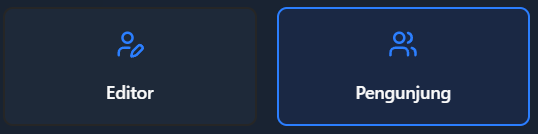

# 🛡️ Role Pengguna HisTree

*Dalam ekosistem digital pohon keluarga, setiap anggota memiliki peran yang disesuaikan dengan kebutuhan dan kemampuan masing-masing.*

---

## 🎭 Struktur Role dalam HisTree

HisTree menerapkan sistem **dua tingkat akses** yang ditentukan saat pembuatan [**Token Registrasi**](/docs/apa-itu/token_registrasi.md).

---

## 👀 Pengunjung: Penikmat Warisan Keluarga

**Pengunjung** adalah anggota yang fokus pada eksplorasi dan apresiasi sejarah keluarga tanpa beban administratif.

### Akses & Privilese
- **Visual Access**: Melihat seluruh album foto dan galeri keluarga
- **Genealogi**: Navigasi lengkap pohon silsilah dan profil anggota
- **Kontribusi**: Memberikan saran dan masukan melalui halaman [Saran & Masukan](https://abdul-muthalib.histree.id/feedback)

---

## ✏️ Editor: Kurator Data Keluarga

**Editor** berperan sebagai pengelola aktif yang bertanggung jawab atas integritas dan pengembangan database keluarga.

### Kapabilitas Penuh
- **Content Management**: Upload, edit, dan organisasi foto profil serta album
- **Access Control**: Pembuatan dan distribusi token registrasi
- **Data Governance**: Edit informasi anggota dan koreksi data
- **Community Management**: Respons saran dan masukan dan moderasi komunikasi keluarga

---

## ⚖️ Matriks Perbandingan Akses

| Fitur | Pengunjung | Editor |
|-------|------------|--------|
| Melihat Konten | ✅ | ✅ |
| Mengubah Data | ❌ | ✅ |
| Membuat Token | ❌ | ✅ |
| Upload Media | ❌ | ✅ |
| Saran & Masukan | Submit | Manage |
---

## ⚠️ Kebijakan Khusus untuk Editor

:::warning **IMPORTANT NOTICE**

**Fitur penghapusan anggota keluarga sementara dinonaktifkan.**

**Alasan Teknis:**
- Proteksi terhadap data loss yang tidak dapat dipulihkan
- Preservasi integritas historis database keluarga
- Pengembangan sistem backup dan restore yang sedang berlangsung

**Best Practices:**
- Verifikasi data sebelum melakukan input
- Koordinasi dengan anggota keluarga lain sebelum menambah profil baru
- Dokumentasi sumber informasi untuk akuntabilitas
:::

---

## 🎯 Kriteria Pemilihan Role

### Memilih Pengunjung
Ideal untuk anggota yang:
- Prioritas pada konsumsi konten dibanding pengelolaan
- Waktu terbatas untuk aktivitas maintenance
- Preferensi pengalaman yang simple dan straightforward

### Memilih Editor
Cocok untuk anggota yang:
- Memiliki passion dalam genealogi dan preservasi sejarah
- Siap mengalokasikan waktu
- Comfortable dengan tanggung jawab data accuracy

---

## 🤝 Model Kolaborasi

Ekosistem HisTree berfungsi optimal melalui sinergi antara kedua role:

**Pengunjung** menyediakan perspektif user experience dan masukan berharga, sementara **Editor** memastikan kualitas data dan aksesibilitas konten. Dynamic ini menciptakan sustainable community di mana setiap kontribusi memiliki nilai.

---

## 📞 Support & Assistance

Untuk pertanyaan lebih lanjut:
- Konsultasi dengan editor keluarga yang sudah aktif
- Koordinasi melalui feedback system internal
- Kontak pengelola platform untuk issue teknis

*Setiap peran dalam HisTree memiliki value proposition unik yang berkontribusi pada visi besar pelestarian sejarah keluarga digital.*

*Terakhir diperbarui pada: Rabu, 25 Juni 2025*