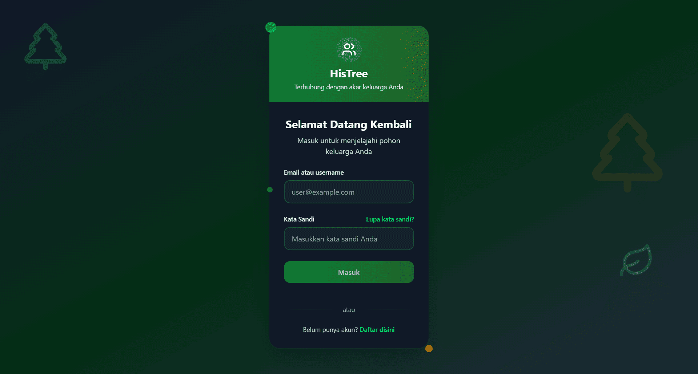
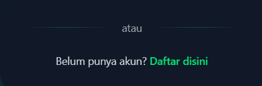
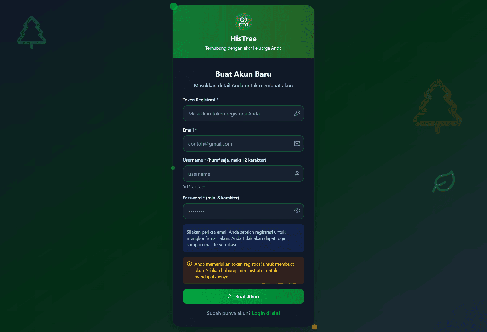
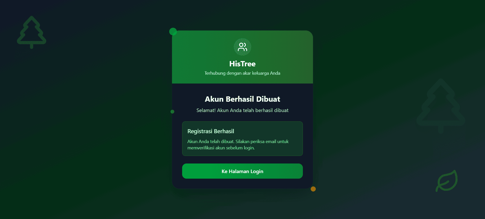
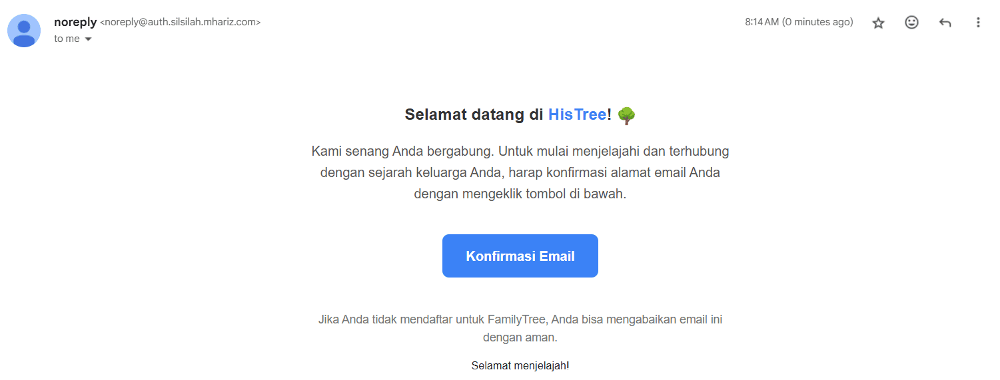

# 🪪 Membuat Akun Histree
*Mulai perjalanan menelusuri jejak sejarah leluhur dengan bergabung dalam platform digital keluarga.*

---

## 🚪 Langkah 1: Akses Portal Utama
Buka **[abdul-muthalib.histree.id](https://abdul-muthalib.histree.id/)** melalui browser pilihan Anda. Halaman beranda akan menampilkan interface login sebagai akses masuk ke dunia silsilah digital.

> 🌟 **Insight:** Setiap generasi meninggalkan warisan cerita yang berharga untuk dikenang.

---

## 👥 Langkah 2: Pilih Opsi Registrasi
Pada bagian bawah halaman, temukan link **"Daftar Disini"** untuk mengakses formulir pendaftaran anggota baru.

  
  
  
  *Gateway menuju keanggotaan platform! 🎯*

---

## 📝 Langkah 3: Lengkapi Data Registrasi
Halaman pendaftaran akan menampilkan form yang perlu diisi dengan informasi akurat untuk membuat profil Anda.

### 🎫 Informasi yang Diperlukan

| 📋 **Field** | 💡 **Deskripsi** | ⚙️ **Ketentuan** | 💭 **Contoh** |
|--------------|------------------|-------------------|---------------|
| **🎟️ Token Registrasi** | Kunci akses eksklusif dari administrator | Wajib - hubungi pengelola | `HERITAGE2024` |
| **📧 Email** | Alamat surel aktif untuk verifikasi | Format valid & dapat diakses | `budi.santoso@gmail.com` |
| **👤 Username** | Identitas unik dalam sistem | Alfabet, maksimal 12 karakter | `budisantoso` |  
| **🔐 Password** | Sandi keamanan pribadi | Minimal 8 karakter kombinasi | `Silsilah@2024` |

---

## 🛡️ Panduan Keamanan Sandi

:::tip 🔒 Membuat Password Kuat
- **Gabungan lengkap**: Huruf kapital, huruf kecil, angka, simbol khusus
- **Hindari informasi pribadi**: Tanggal lahir, nama panggilan umum
- **Penyimpanan aman**: Catat di buku khusus atau aplikasi password manager
- **Rekomendasi**: `Warisan#Keluarga99` ✅
- **Hindari**: `123456789` atau `qwerty` ❌
:::

---

## 🎫 Memahami Token Registrasi

:::info 🔑 Fungsi Token Akses
**Token Registrasi** berfungsi sebagai kunci digital yang memastikan eksklusivitas anggota dalam pohon silsilah. Fitur ini menjaga privasi dan integritas data genealogi.

### 🤝 Cara Memperoleh Token:
- **Administrator Platform**: Konsultasi dengan pengelola website
- **Anggota Terdaftar**: Tanyakan kepada saudara yang sudah bergabung
- **Kontak Langsung**: Komunikasi dengan tim support histree.id

Panduan membuat token (Untuk Editor): [🎫 Token Registrasi - Kunci Eksklusif Keluarga](/docs/apa-itu/token_registrasi)

*Token ini merupakan undangan khusus untuk bergabung dalam komunitas heritage digital! 🎉*
:::

---

## 🚀 Langkah 4: Submit Formulir
Setelah seluruh field terisi dengan benar, tekan tombol **"Buat Akun"** untuk memproses registrasi. Sistem akan mengolah data dalam beberapa detik.

> 🎯 **Sukses!** Proses registrasi tahap pertama telah selesai

---

## 📧 Langkah 5: Verifikasi Email

### 📬 Pemeriksaan Inbox
Platform akan mengirimkan email konfirmasi ke alamat yang didaftarkan. Pesan ini berisi tautan aktivasi untuk mengaktifkan akun Anda.

### ✨ Aktivasi Akun
Klik tombol **"Verifikasi Email"** dalam pesan yang diterima. Browser akan mengarahkan Anda kembali ke website dengan status akun yang sudah aktif.

---

## 🆘 Troubleshooting Email Verifikasi

:::warning 📧 Solusi Masalah Email
**Belum menerima email konfirmasi? Ikuti langkah berikut:**

1. **🔍 Cek Folder Spam/Junk** - Email mungkin tersaring otomatis
2. **⏱️ Beri Waktu** - Pengiriman bisa memakan waktu hingga 10 menit  
3. **🔄 Refresh Mailbox** - Muat ulang kotak masuk email
4. **✅ Validasi Data** - Pastikan alamat email yang diinput sudah tepat
5. **📞 Hubungi Support** - Konsultasi dengan tim teknis jika masalah berlanjut

*Catatan: Proses verifikasi memerlukan kesabaran! 😊*
:::

---

## 🎉 Selamat Bergabung!

**Akun Anda telah aktif dan siap digunakan!** 🥳

Anda kini resmi menjadi bagian dari ekosistem digital heritage keluarga. Waktunya mengeksplorasi fitur-fitur platform, menambahkan informasi genealogi, dan menghubungkan berbagai generasi dalam satu pohon silsilah komprehensif.

### 🌟 Aktivitas Selanjutnya:
- **Masuk** menggunakan kredensial yang telah dibuat
- **Jelajahi** berbagai menu dan fitur tersedia
- **Tambahkan** data anggota dan relasi keluarga
- **Dokumentasikan** cerita dan foto bersejarah

---

*"Genealogi bukan sekadar garis keturunan, melainkan jalinan kasih sayang yang menghubungkan masa lalu, kini, dan mendatang." 💝*

---

## 🤔 Butuh Bantuan?

Jika ada yang membingungkan dalam menjelajahi beranda:
- 👥 Tanya anggota keluarga yang sudah mahir
- 🔄 Coba eksplorasi bebas - tidak ada yang rusak!

**Prinsip: Dalam keluarga, kita saling mendukung dan berbagi pengetahuan! 🤗**

*Terakhir diperbarui pada: Jumat, 25 Juni 2025*