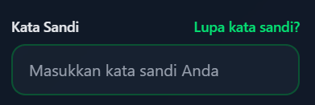
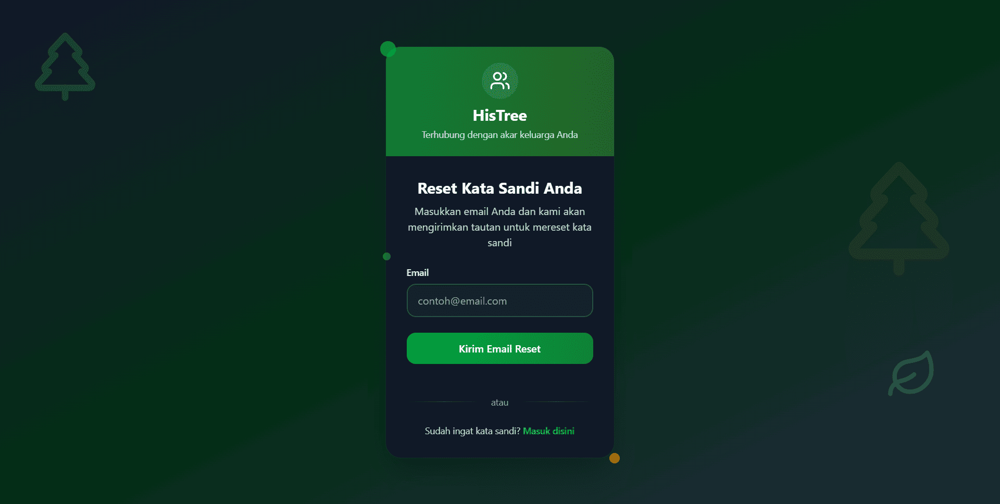
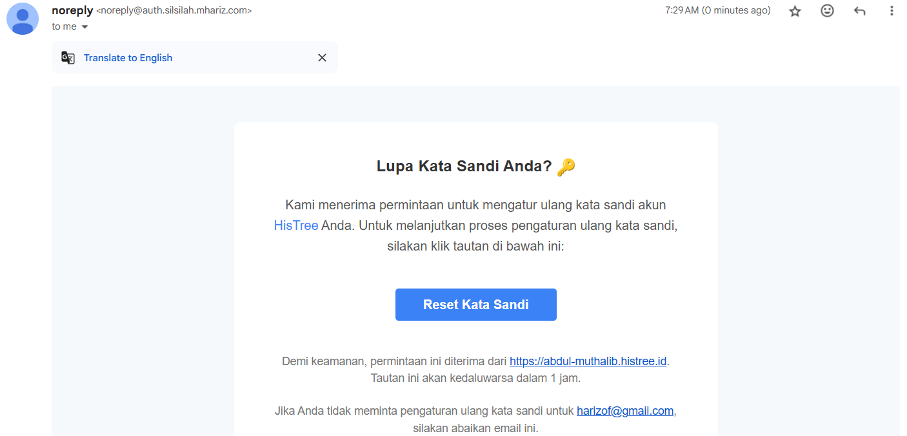
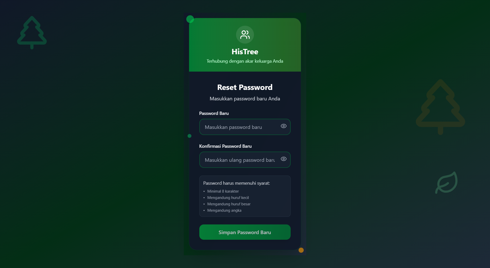

# 🔐 Reset Password Histree
*Akses ke pohon keluarga digital Anda hilang? Tenang, kami akan memandu Anda kembali!*

---

## 🚪 Akses Halaman Reset

Kunjungi **[abdul-muthalib.histree.id](https://abdul-muthalib.histree.id/)** dan perhatikan bagian login. Di sebelah kanan kolom password, terdapat link **"Lupa kata sandi?"** yang akan memulai proses pemulihan akun Anda.

:::tip **Bookmark Halaman Ini**
Simpan URL ini untuk akses cepat di kemudian hari!
:::

  
  
  *Link pemulihan password tersedia 24/7 untuk Anda 🆘*

---

## ✍️ Verifikasi Email

Setelah mengklik link reset, formulir verifikasi akan tampil. Masukkan alamat email yang terdaftar dalam sistem Histree keluarga Anda.

:::warning **Pastikan Email Aktif**
Gunakan email yang masih dapat Anda akses untuk menerima instruksi reset!
:::

---

## 📧 Konfirmasi via Email

Periksa inbox email Anda dalam beberapa menit. Email konfirmasi akan berisi tautan khusus untuk melanjutkan proses reset password.

> **Pro tip:** Jika email tidak muncul di inbox, cek folder spam atau promotions.

---

## 🔑 Pembuatan Password Baru

Klik tautan dalam email untuk diarahkan ke formulir password baru. Inilah saatnya membuat kombinasi yang aman namun mudah diingat.

### 💪 Kriteria Password Ideal:

**Kekuatan:**
- Minimum 8 karakter untuk keamanan dasar
- Kombinasi huruf besar-kecil (contoh: KeluargaBesar)
- Sertakan angka atau simbol (contoh: Silsilah2024!)

**Hindari:**
- Data personal seperti tanggal lahir
- Nama lengkap atau alamat
- Password yang terlalu umum

---

## 🎯 Login dengan Kredensial Baru

Password berhasil diperbarui! Kembali ke halaman login dan gunakan email beserta password baru untuk mengakses dashboard pohon keluarga Anda.

### 🛡️ Praktik Keamanan Terbaik:

- **Simpan di password manager** atau tempat aman lainnya
- **Batasi akses** hanya untuk anggota keluarga tepercaya  
- **Update berkala** setiap 3-6 bulan sekali

---

## 🤔 Butuh Bantuan?

Jika ada yang membingungkan dalam menjelajahi beranda:
- 👥 Tanya anggota keluarga yang sudah mahir
- 🔄 Coba eksplorasi bebas - tidak ada yang rusak!

***"Menjaga akses ke warisan keluarga digital sama pentingnya dengan merawat foto keluarga di album fisik."*** 💝

*Terakhir diperbarui pada: Jumat, 25 Juni 2025*