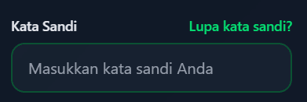
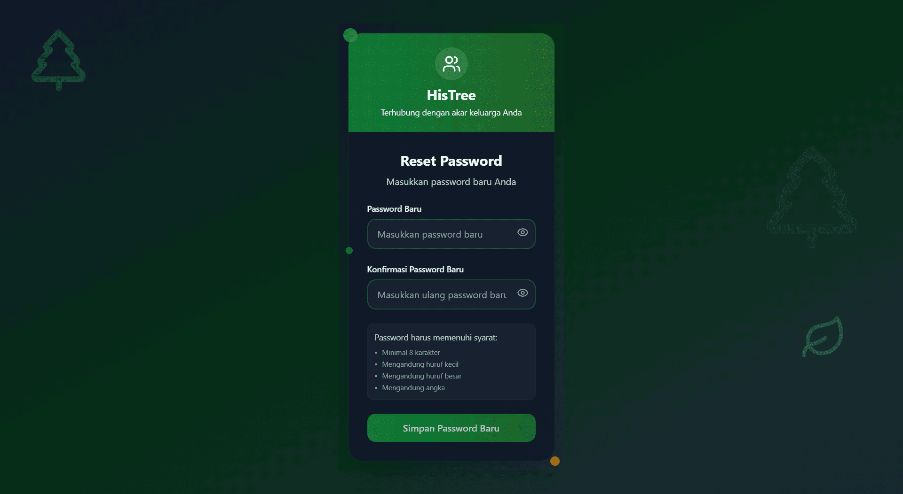

# 🔐 Panduan Mudah Mengganti Password

*Jangan khawatir jika lupa password! Ikuti langkah sederhana ini untuk kembali mengakses pohon keluarga digital Anda.*

---

## 🚪 Langkah 1: Mulai dari Halaman Masuk

Buka **[abdul-muthalib.histree.id](https://abdul-muthalib.histree.id/)** di browser Anda. Halaman pertama yang muncul adalah "pintu masuk" ke dunia pohon keluarga digital Anda.

:::tip **Tips**
Bookmark halaman ini agar mudah ditemukan lain waktu!
:::

---

## 🔍 Langkah 2: Temukan Tombol "Lupa Kata Sandi"

Di sebelah kanan kolom password, ada tulisan **"Lupa kata sandi?"** yang siap membantu Anda. Klik tulisan ini untuk memulai proses pemulihan.

  
  
  
  *Tombol penyelamat yang selalu ada untuk Anda! 🆘*

---

## ✍️ Langkah 3: Masukkan Email Anda

Formulir sederhana akan muncul. Cukup ketik alamat email yang Anda gunakan saat mendaftar di Histree.

:::warning **Penting**
Pastikan email yang dimasukkan benar dan masih aktif!
:::
---

## 📧 Langkah 4: Buka Email dan Klik Tautan Ajaib

Cek kotak masuk email Anda (jangan lupa periksa folder spam juga!). Anda akan menerima email khusus seperti ini:

**Klik tautan di dalam email** untuk melanjutkan ke langkah terakhir.

---

## 🔑 Langkah 5: Buat Password Baru yang Kuat

Selamat! Anda hampir selesai. Sekarang saatnya membuat password baru yang mudah diingat tapi sulit ditebak orang lain.

### 💪 Tips Password yang Baik:
- **Minimal 8 karakter** - semakin panjang semakin aman
- **Kombinasi huruf besar dan kecil** - contoh: MyFamily2024
- **Tambahkan angka atau simbol** - contoh: Keluarga@Ku123
- **Hindari informasi pribadi** - seperti tanggal lahir atau nama lengkap

---

## 🎉 Selesai! Selamat Menjelajahi Pohon Keluarga

Password baru Anda sudah siap digunakan! Sekarang Anda bisa kembali menjelajahi dan mengelola pohon keluarga digital dengan aman.

### 🛡️ Untuk Keamanan Tambahan:
- **Catat password** di tempat yang aman
- **Jangan bagikan** dengan sembarangan orang
- **Ganti secara berkala** untuk keamanan maksimal

---

*"Keluarga adalah harta yang paling berharga, begitu juga dengan akses ke memori keluarga kita. Jagalah dengan baik!" 💝*

---

## 📞 Butuh Bantuan?

Jika masih ada pertanyaan, jangan ragu untuk:
- 🤝 Bertanya kepada anggota keluarga yang sudah terdaftar
- 📧 Menghubungi editor keluarga
- 💬 Konsultasi dengan pengelola histree keluarga Anda

**Ingat: Kita semua keluarga, dan keluarga selalu saling membantu! 🤗**