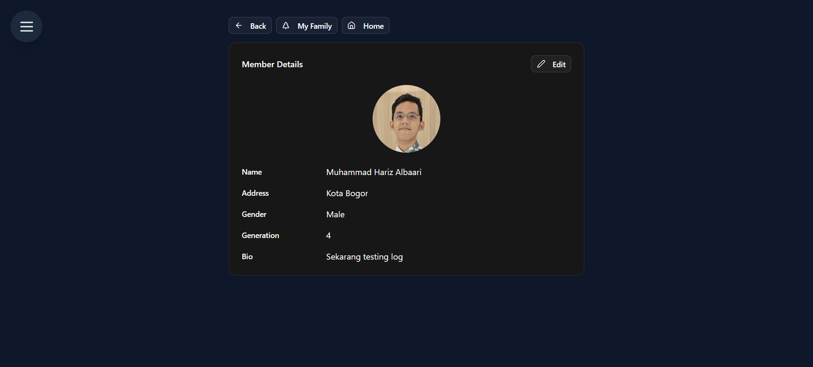
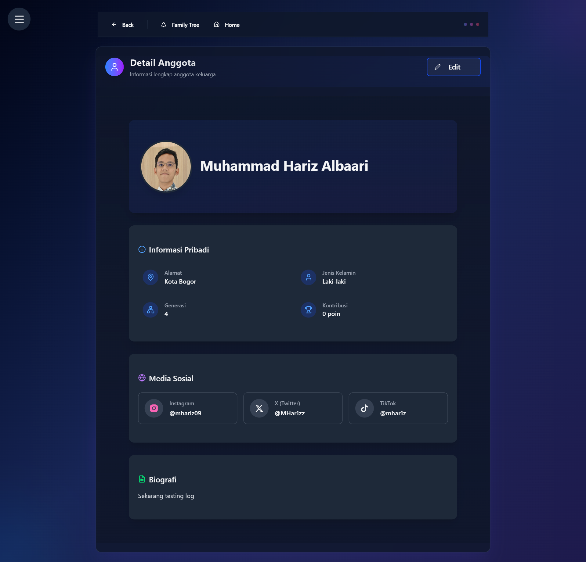

# v2.1.3

## Pembaruan page anggota keluarga 

### Tampilan
Tampilan lama :

Tampilan baru :

### Field data
Data lama :
| Field | Deskripsi |
|-------|-----------|
| `name` | Nama lengkap anggota |
| `gender` | Jenis kelamin anggota (opsional) |
| `bio` |  Biografi atau deskripsi anggota (opsional) |
| `address` |  Alamat fisik anggota (opsional) |
| `profile_picture_url` |  URL foto profil anggota (opsional) |

Tambahan Data baru :
| Field | Deskripsi |
|-------|-----------|
| `birthdate` | Tanggal lahir anggota (opsional) |
| `deathdate` | Tanggal meninggal anggota (opsional) |
| `instagram` |  Handle atau URL Instagram (opsional) |
| `twitter` | Handle atau URL Twitter (opsional) |
| `tiktok` | Handle atau URL TikTok (opsional) |

## Pembaruan form anggota keluarga
