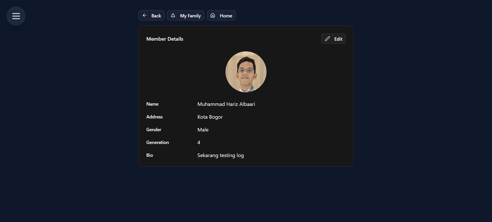
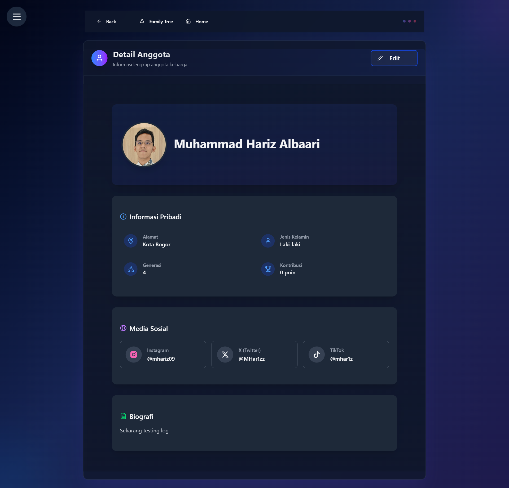
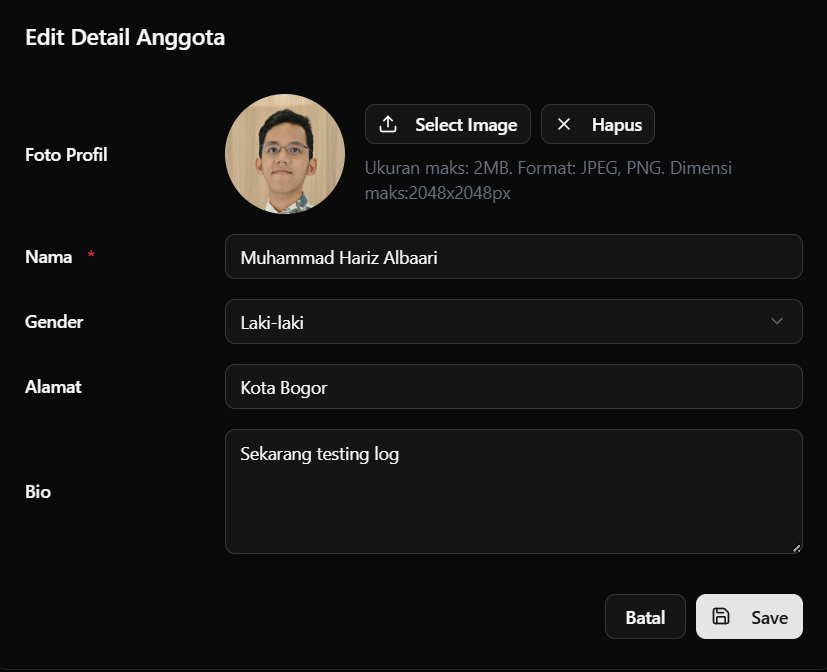
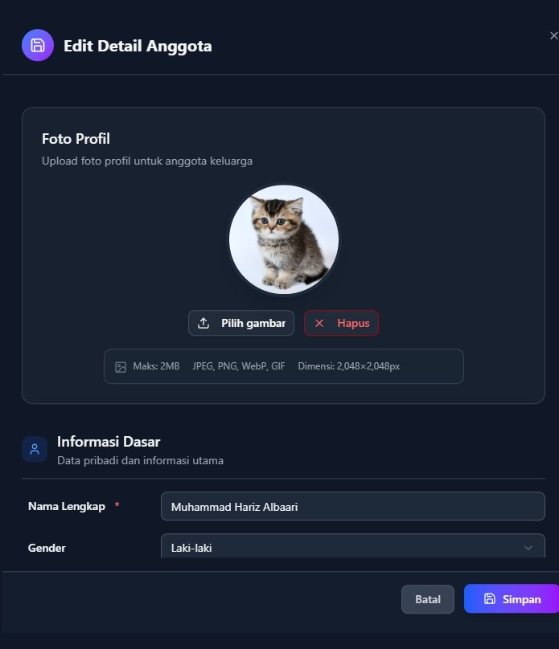
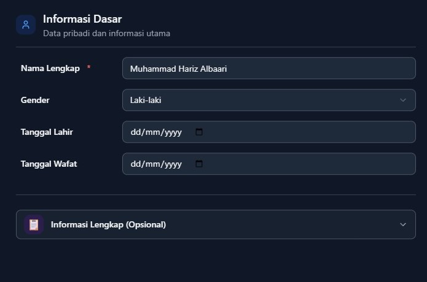
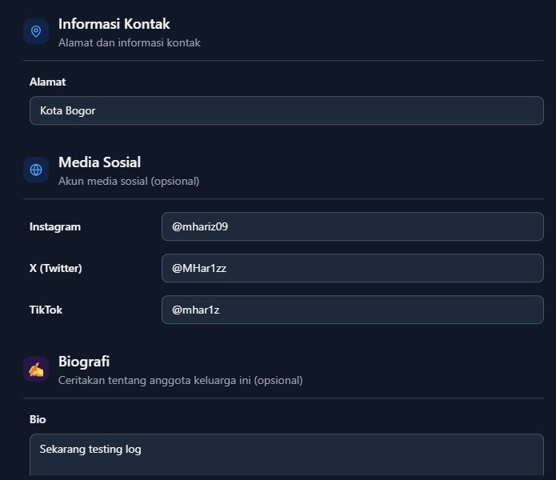

# 🚀 HisTree v2.1.3 - "Generasi Baru Profil Keluarga"

*Update terbesar untuk profil anggota keluarga! Kini lebih lengkap, modern, dan terhubung dengan dunia digital.*

---

## 🎯 **Ringkasan Update**

Versi 2.1.3 membawa **revolusi besar** dalam cara kita menampilkan dan mengelola profil anggota keluarga. Dari tampilan yang lebih segar hingga integrasi media sosial - semuanya dirancang untuk generasi digital!

### ✨ **Highlights Utama:**
- 🎨 **Desain Profil Baru** - Tampilan yang lebih modern dan informatif
- 📱 **Integrasi Media Sosial** - Terhubung dengan Instagram, Twitter, dan TikTok
- 📅 **Timeline Kehidupan** - Tanggal lahir dan wafat untuk dokumentasi lengkap
- 🖥️ **Form Editor Terbaru** - Interface yang lebih user-friendly

---

## 👥 Pembaruan Halaman Anggota Keluarga

### 🎨 **Transformasi Visual yang Menakjubkan**

#### 📱 **Tampilan Lama vs Baru**

**🕰️ Era Lama:**

*Tampilan klasik yang fungsional namun kurang engaging*

**✨ Era Baru:**

*Desain modern dengan informasi yang lebih kaya dan mudah dibaca*

#### 🌟 **Keunggulan Tampilan Baru:**
- **🎯 Layout Terstruktur** - Informasi tersusun rapi dan mudah ditemukan
- **📱 Responsive Design** - Sempurna di semua perangkat
- **🎨 Visual Hierarchy** - Prioritas informasi yang jelas
- **💫 User Experience** - Navigasi yang lebih intuitif

---

## 📊 **Evolusi Data Anggota Keluarga**

### 🗃️ **Data Versi Lama (v2.1.2 dan sebelumnya)**

| 🏷️ **Field** | 📝 **Deskripsi** | 🎯 **Status** |
|---------------|------------------|---------------|
| `name` | Nama lengkap anggota | ✅ **Wajib** |
| `gender` | Jenis kelamin anggota | 🔄 **Opsional** |
| `bio` | Biografi atau deskripsi anggota | 🔄 **Opsional** |
| `address` | Alamat fisik anggota | 🔄 **Opsional** |
| `profile_picture_url` | URL foto profil anggota | 🔄 **Opsional** |

### 🆕 **Tambahan Data Baru (v2.1.3)**

| 🏷️ **Field** | 📝 **Deskripsi** | 🎯 **Kegunaan** |
|---------------|------------------|-----------------|
| `birthdate` | 🎂 Tanggal lahir anggota | Timeline kehidupan & reminder ulang tahun |
| `deathdate` | 🕊️ Tanggal wafat anggota | Dokumentasi sejarah & memorial |
| `instagram` | 📸 Handle atau URL Instagram | Terhubung dengan profil Instagram |
| `twitter` | 🐦 Handle atau URL Twitter | Terhubung dengan profil Twitter/X |
| `tiktok` | 🎵 Handle atau URL TikTok | Terhubung dengan profil TikTok |

---

## ✏️ **Pembaruan Form Editor Anggota**

### 🖥️ **Interface Baru yang Revolusioner**

#### 🕰️ **Form Lama:**

*Form sederhana dengan field terbatas*

#### ✨ **Form Baru Multi-Step:**

**📋 Step 1 - Foto Profil:**

*Data pribadi fundamental*

**📱 Step 2 - Informasi Dasar:**

**✅ Step 3 - Informasi Tamabahan:**

### 🎯 **Keunggulan Form Baru:**

#### 🚀 **User Experience yang Lebih Baik:**
- **📝 Multi-Step Process** - Tidak overwhelming, step-by-step
- **✅ Real-time Validation** - Error handling yang lebih baik
- **📱 Mobile-friendly** - Sempurna di smartphone

#### 🔧 **Fitur Editor yang Ditingkatkan:**
- **🎨 Rich Text Editor** - Untuk bio yang lebih menarik
- **📅 Date Picker** - Input tanggal yang user-friendly
- **🔗 URL Validator** - Memastikan link media sosial valid

---

## 🎉 **Dampak Positif Update ini**

### ✏️ **Untuk Editor:**
- **⚡ Efisiensi Tinggi** - Form yang lebih mudah dan cepat
- **🎯 Data Akurat** - Validation yang mencegah kesalahan
- **📊 Informasi Kaya** - Lebih banyak data untuk dikelola
- **🔄 Workflow Smooth** - Proses editing yang lancar

### 👀 **Untuk Pengunjung:**
- **👁️ Visual Menarik** - Tampilan yang lebih eye-catching
- **📖 Informasi Lengkap** - Profil yang lebih informatif
- **📱 Akses Mudah** - Link langsung ke media sosial
- **🎨 Experience Terbaik** - Browsing yang menyenangkan

---
## 💡 **Saran untuk Pengguna:**
- **🔄 Update Profil** - Lengkapi data dengan field baru
- **📱 Hubungkan Sosmed** - Manfaatkan integrasi media sosial
- **🎂 Set Tanggal Lahir** - Aktifkan reminder ulang tahun
- **💬 Berikan Feedback** - Bantu kami terus berkembang

**Selamat menjelajahi fitur-fitur baru! Mari bersama-sama membangun warisan digital yang akan dikenang generasi mendatang.** 🌳✨

---

## 📞 Butuh Bantuan?

Jika masih ada pertanyaan, jangan ragu untuk:
- 🤝 Bertanya kepada anggota keluarga yang sudah terdaftar
- 📧 Menghubungi editor keluarga
- 💬 Konsultasi dengan pengelola histree keluarga Anda

**Ingat: Kita semua keluarga, dan keluarga selalu saling membantu! 🤗**