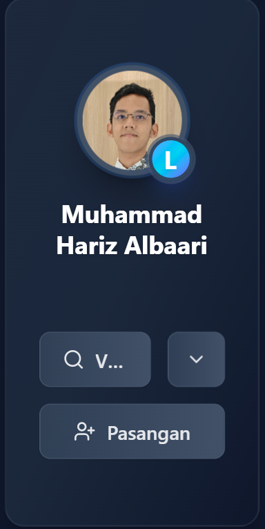

# 🚀 HisTree v2.2 - Perubahan UI dan Penambahan Fitur "Tambah Anggota"

## 🎨 Desain Ulang Tampilan Beranda

🔙 Tampilan Lama:

✨ Tampilan Baru:

Kartu anggota keluarga kini memiliki desain yang lebih bersih, dengan pengurangan warna dan kontras yang berlebihan. Ini membantu informasi utama menjadi lebih menonjol dan mudah dibaca.

## 🆕 Fitur Baru: Tambah Pasangan/Anak 👶💍
Klik tombolnya ini, dan Anda bisa langsung mengisi formulir untuk menambahkan anggota keluarga baru sebagai pasangan atau anak.

Kami juga telah melakukan perbaikan pada tata letak dengan menambahkan kartu kosong untuk pasangan yang tidak memiliki anak. Ini memastikan bahwa struktur pohon keluarga Anda tetap rapi dan mudah dipahami.

*Terakhir diperbarui pada: Jumat, 07 Juli 2025*